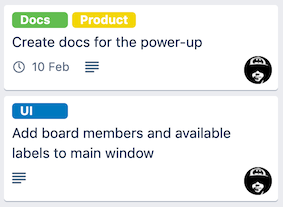

# Memo-to-Trello

## What is Memo-to-Trello?

Memo-to-Trello is a simple Trello Power-Up, that helps transforming your longform written texts into neat little Trello cards. It will extract card names and descriptions from your text and add the proper labels, members and due date to the card.

You can create dozens of cards with just one click. Just as an example, this text:

```

Todo items decided in the meeting:

::Create docs for the power-up

@andrassomi will set up a Gitbook site with a few simple pages
to document the power-up. $due: 2020-02-10

#Docs #Product


::Add board members and available labels to main window

@andrassomi - Board members and labels should appear somewhere on the #UI
to make text editing easier.
```

will become these Trello cards:



### What's a Trello Power-Up?

Power-Ups are basically external plugins that enhance the funcionality of Trello. [Read more about Power-Ups here](https://help.trello.com/article/1094-what-are-power-ups).

## Privacy

When you use Memo-to-Trello, all the magic happens right in your browser. Memo-to-Trello will not rely on any server or external service except for Trello's own REST API, so all your precious data and private information stays with you and Trello.
